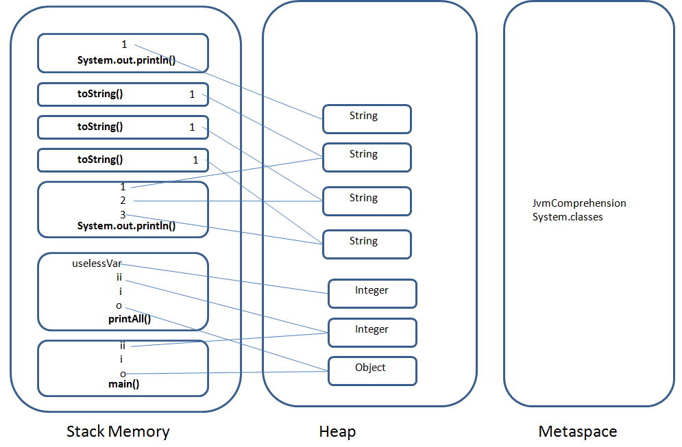

### Решение  
Подсистема загрузки классов ClassLoader осуществляет поиск класса JvmComprehension и системных классов, когда они находятся - то добавляются в обасть памями Metaspace.  
Подсистема загрузки классов выполняет подготовку классов к выполнения: проверка, подготовка примитивов, связывание ссылок.  
Создается фрейм вызова метода main() в области памяти Stack Memory.  
1. В фрейме main() создаетя запись о переменной i.
2. В области heap создается объект типа Object. В фрейме main() создается запись об объекте o.
3. В области heap создается объект типа Integer. В фрейме mail() воздается запись об объекте ii.
4. В Stack memory создется фрейм вызова метода printAll(). В фрейме printAll() воздаются переменные o, i, ii, при этом i копирует значение и сохраняет его в Stack Memory, а o и ii ссылаются на соответствующие объекты в heap.
5. В heap создается новый объект Integer. В фрейме printAll() создается переменная uselessVar с ссылкой на объект.
6. Создается фрейм вызова метода System.out.println(), в heap создаются 3 объекта String, в фрейме создаются ссылки на 3 объекта String, соответственно создаются фреймы вызовов toString() из которых идет ссылка на эти объекты String в heap. 
7. В Stack memory Создается фрейм вызова метора System.out.println("finished"). В него помещается ссылка на "finished".  

# app-for-jenkins
